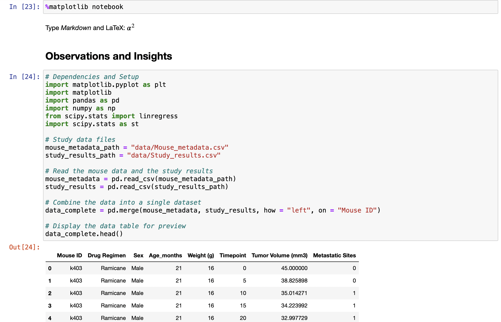
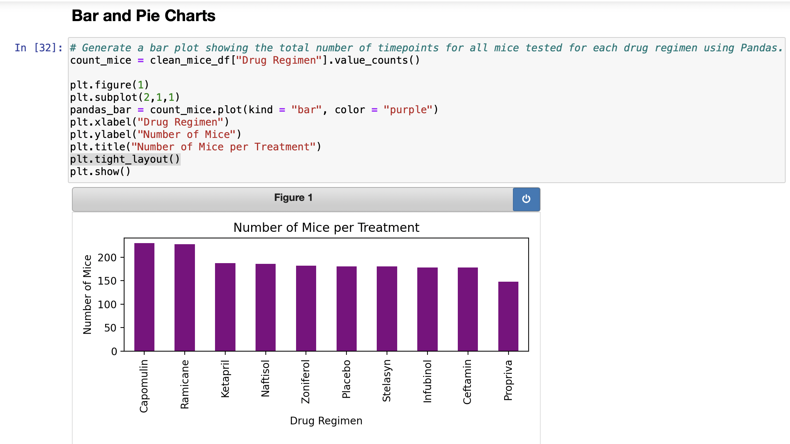

# Matplotlib_challenge

## Overview of Project

### Pymaceuticals Instructions

Your tasks are to do the following:

    * Prepare the data.

    * Generate summary statistics.

    * Create bar charts and pie charts.

    * Calculate quartiles, find outliers, and create a box plot.

    * Create a line plot and a scatter plot.

    * Calculate correlation and regression. 

    * Submit your final analysis.

### Purpose

I am utilizing matplotlib and Jupyter Notebook to analyze data from a pharmaceutical company in order to get more detailed information about what the data on the tested drugs shows.

## Analysis and Challenges

### Analysis of Outcomes Based on Goals

* During this assignment I was able to complete all the goals and objectives for the assignment. I used what I have learned in the class to trouble shoot the code as I went through with Jupyter Notebook and made sure I was fully understanding what each part of my code did through labeling, so when an error popped up I knew how to approach the problem.

### Challenges and Difficulties Encountered

* I think the biggest challenge for me was figuring out how to show multiple of the same type of graph within the same file without the graphs overlapping. I ended up giving each graph a figure value and that fixed the problem. 

### Jupyter Notebook

## Results

* What are two conclusions you can draw about the data?

    * There is a correlation between weight and tumor volume. The heavier the mouse, the larger the tumor volume. 
    * The Capomulin drug seems to have a positive impact on shrinking the overall size of the tumor overtime.
    * The drug Infubinol had the only outlier when looking at the box plot. This is also significant because it had mostly mice with large tumors, so the one mouse with the smaller tumor might throw off the average for the drug overall.

* What are some limitations of this dataset?

    * Are all the other environmental factors about the mice the same?
